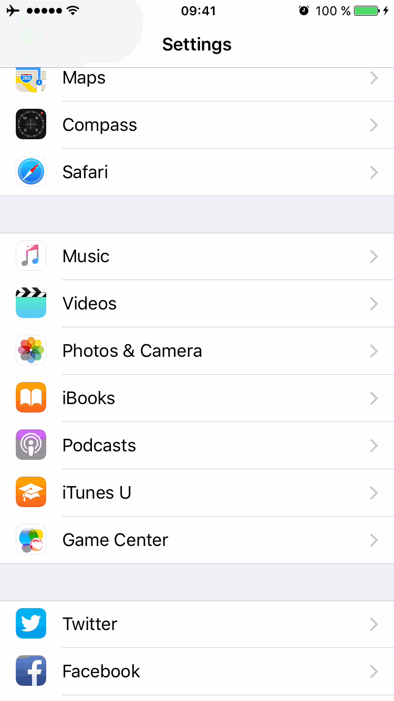

Javascript air mobile application
====

[Javascript air](https://javascriptair.com/) on your mobile ([iOS](https://itunes.apple.com/fr/app/js-air/id1112141070?mt=8) and [Android](https://play.google.com/store/apps/details?id=com.jsair)) for `free` and `open source`.

>You love javascript? Nice! This application is `built with javascript`.

This is not a standard hybrid application but a more powerfull hybrid application where javascript is bridge to native: [React Native](https://facebook.github.io/react-native/).

##### *Why an app when there is already a website?*

Javascript air website is a super nice website and is open source ([feel free to contribute](https://github.com/javascriptair/site)).
But to my mind having a mobile app is as natural as having a website.

### setup and launch

Just follow [official website instructions](https://facebook.github.io/react-native/docs/getting-started.html) (*it is well documented*).

### content summary

- **both**: `REDUX`
- **iOS**: sidemenu (`react-native-side-menu`)
- **android**: Drawer (React Native one is nice enough)
- **both**: navigator
- **both**: react-native-scrollable-tab-view
- **both**: react-native-animatable
- **both**: react-native-progress
- **both**: react-native-vector-icons

### Current versions
- iOS v1.0.2
  - dependencies upgrade
  - tabBar style
  - Episodes: add to calendar no more link to hangoutId but calendarId
    - Note: if you encounter an error like `to many redirections` when tapping **add to calendar**:
     - go to `Settings > safari`
     - **clear safari data**
     - **be sure cookies are enabled**

     

- android v1.0.4
  - dependencies upgrade
  - Episodes: add to calendar no more link to hangoutId but calendarId
  - tabBar style

### license

The MIT License (MIT)

Copyright (c) 2016 Erwan DATIN

Permission is hereby granted, free of charge, to any person obtaining a copy of this software and associated documentation files (the "Software"), to deal in the Software without restriction, including without limitation the rights to use, copy, modify, merge, publish, distribute, sublicense, and/or sell copies of the Software, and to permit persons to whom the Software is furnished to do so, subject to the following conditions:

The above copyright notice and this permission notice shall be included in all copies or substantial portions of the Software.

THE SOFTWARE IS PROVIDED "AS IS", WITHOUT WARRANTY OF ANY KIND, EXPRESS OR IMPLIED, INCLUDING BUT NOT LIMITED TO THE WARRANTIES OF MERCHANTABILITY, FITNESS FOR A PARTICULAR PURPOSE AND NONINFRINGEMENT. IN NO EVENT SHALL THE AUTHORS OR COPYRIGHT HOLDERS BE LIABLE FOR ANY CLAIM, DAMAGES OR OTHER LIABILITY, WHETHER IN AN ACTION OF CONTRACT, TORT OR OTHERWISE, ARISING FROM, OUT OF OR IN CONNECTION WITH THE SOFTWARE OR THE USE OR OTHER DEALINGS IN THE SOFTWARE.
